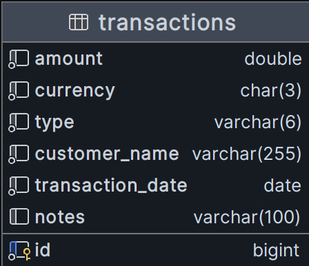

## Building application

---

### Pre-requisites

* JDK 17
* Maven 3
* Docker CLI

## Running the application

---

* Run the docker compose file to start MySQL server.
* Spring Boot will automatically create the required schema and table at boot using the script inside `resources/db/migration` directory.

## APIs

---

1. Documentation available at `/swagger-ui/index.html`

   * Assuming the server is running on `localhost:8080`, click the below link to go to the documentation.
   * [API Documentation](http://localhost:8080/swagger-ui/index.html)


2. The `POST` API has input validations at controller level and passes the errors to the user in the response in case of any constraint violation.

   * See `TransactionRequest` for the constraints, handled by `KiranaExceptionHandler`.
   * Following is a sample incorrect request object:
   ```json
   {
    "amount": -100.5,
    "currency": "AUD",
    "type": "random",
    "customerName": " ",
    "transactionDate": "2125-12-29",
    "notes": "Purchase of Chocolates"
   }
   ```
   * The above request will lead to the following response:
   ```json
   {
    "errors": [
        "type: must either be credit or debit",
        "amount: must be greater than 0",
        "customerName: must not be blank",
        "transactionDate: must be a date in the past or in the present",
        "currency: only INR and USD supported"
    ]
   }
   ```

3. The `GET` API has 2 optional parameters `startDate` & `endDate`. Without `endDate` specified, the current date will be taken. And, without `startDate` specified, the previous date of the `endDate` will be taken.

## ER Diagram

---

